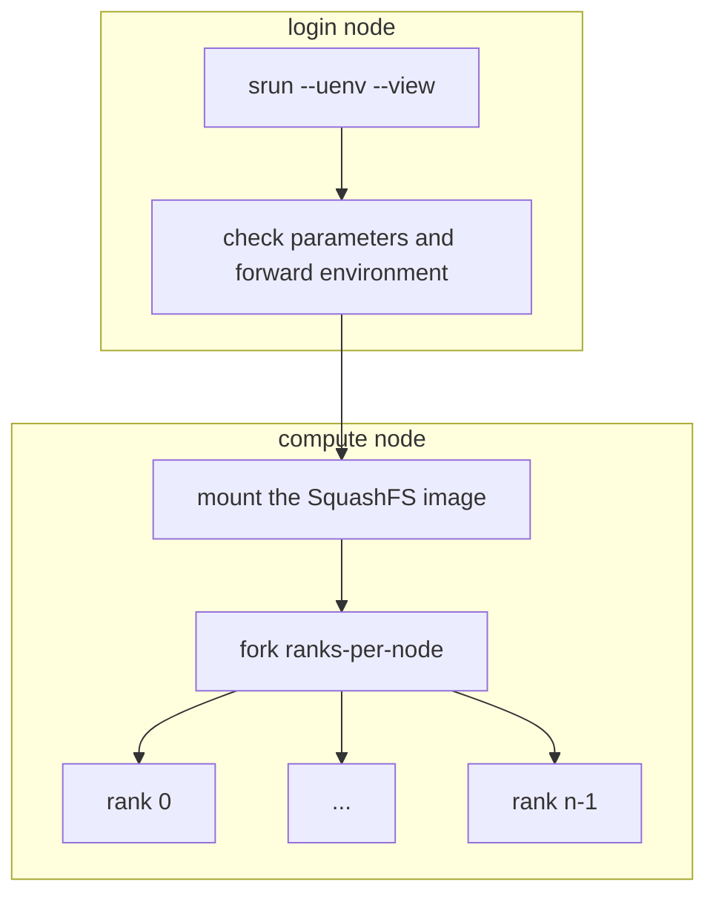

# New Features and Advanced Usage of uenv

<br>

Ben Cumming

bcumming.github.io/uenv-userlab-2026

CSCS User Lab Day 2026

---

# uenv on Alps

On **Daint**, **Eiger**, **Santis** and **Clariden** CSCS support two software environments:

* **uenv**: self-contained application and use-case specific software stacks
* **container engine**: container runtime with SLURM integration

---

# Cray modules on Alps

This Wednesday the `cray` module was removed from Eiger.

* on Eiger `intel-classic/26.07:v1` reproduces the old `PrgEnv-intel` module
    * `intel-classic` 2021 Fortran compiler
    * provided as an stop-gap for projects that require the old compiler
    * upgrade at the first opportunity

---
layout: two-cols
layoutClass: gap-2
---

# uenv documentation

The up-to-date `uenv` documentation is available on the **new CSCS documentation** site:

* [uenv documentation](https://eth-cscs.github.io/cscs-docs/software/uenv/)
* [scientific application uenv](https://eth-cscs.github.io/cscs-docs/software/sciapps/)
* [programming environment uenv](https://eth-cscs.github.io/cscs-docs/software/prgenv/)

The uenv command line provides context-sensitve help using the `--help` flag:
```
uenv --help
uenv image --help
uenv image find --help
uenv run --help
```

::right::


---

# `uenv run`: execute a command in an environment

`uenv run` runs a command with a uenv activated - and returns after it has been run

```
$ which mpicc
which: no mpicc in (/users/bcumming/.local/x86_64/bin:/usr/local/bin:/usr/bin:/bin:/usr/lpp/mmfs/bin:/usr/lib/mit/bin)
$ uenv run --view=default prgenv-gnu/24.11:v2 -- which mpicc
/user-environment/env/default/bin/mpicc
```

This "wraps" the call with the environment:
* later calls are not affected by earlier calls
* compare this to interleaving `module load/swap/unload` between application calls

```
# use a text editor provided by a uenv
$ uenv run --view=ed editors -- nvim
# use the python REPL
$ uenv run --view=default prgenv-gnu/24.11:v2 -- python
# use a graphical application
$ uenv run --view=default netcdf-tools/2024 -- ncview sst_nmc_daSilva_anoms.66-03.DJF.nc
```

---

# New feature: `uenv inspect`

Before v10 of uenv we had run a uenv to inspect its views.

<br>

The new `uenv inspect` command shows information about a uenv without starting it

```bash
$ uenv inspect intel-classic/26.07:v1
repo default:/ritom/scratch/cscs/bcumming/.uenv-images
intel-classic/26.07:v1@eiger%zen2 mount at /user-environment
views:
  spack: configure spack upstream
  modules: activate modules
  intel (default):
```

---

# New feature: Default Views

Some new uenv provide "default views" that are automatically loaded when run without a `--view`.

```
$ uenv inspect X
... show default view

$ uenv start X
... show view loaded
```

<br>

---
layout: two-cols
layoutClass: gap-2
---

# Custom prompts

The `--format` flag to `uenv status` provides short descriptions of the currently loaded uenv:

```
$ uenv status --format=views
prgenv-gnu,editors[editors]
$ uenv status --format=short
prgenv-gnu,editors
```

These can be used to generate a custom prompts, similar to common extensions for Python and git.

::right::

The following in `.bashrc`

```
_set_prompt() {
  local node_name
  node_name=$(hostname)
  node_name=${node_name#*-}

  local opt=""
  local ue
  ue=$(uenv --no-color status --format=views 2>/dev/null)
  [ -n "$uenv_str" ] && opt+=" uenv:${ue}"
  [ -n "$VIRTUAL_ENV" ] && \
    opt+=" py:$(basename "$VIRTUAL_ENV")"

  PS1="${USER}@${CLUSTER_NAME}::${node_name} ${opt} > "
}
PROMPT_COMMAND=_set_prompt
```

Gives the following prompt:

```
bcumming@eiger::ln001 uenv:prgenv-gnu,editors[editors] >
```

---
layout: two-cols
layoutClass: gap-2
---

# SLURM support

On Alps the uenv SLURM plugin configures uenv on the compute nodes of jobs.

When `srun` or `sbatch` are called on the login node with `--uenv` and `--view` flags:
* **srun**: Check the parameters, find the SquashFS image and set environment variables
    * fail early to minimise resource wastage.
* **compute**: mount the SquashFS image before forking the MPI ranks on the node

The SquashFS image is mounted once per node.

::right::



---

# SLURM environments are stateful

discuss how srun 

---
layout: two-cols
layoutClass: gap-1
---

# Using uenv in sbatch jobs

The `--uenv` and `--view` flags are available sbatch:
```
#!/bin/bash
#SBATCH --time=00:10:00
#SBATCH --nodes=1
#SBATCH --ntasks-per-node=1
#SBATCH --uenv=namd/3.0:v3
#SBATCH --view=namd-single-node

# uses the namd uenv
srun namd3 +p 29 +pmeps 5 +setcpuaffinity +devices 0,1,2,3

# override the top-level namd uenv
srun --uenv=prgenv-gnu/24.11 --view=default ./post-proc
```

The uenv and view will be loaded inside the script, and for the first `srun` call.

**Fun fact**: the commands in an sbatch script execute on the first compute node in your job.

::right::

**Best Practice**: specify the uenv where it will be used

```
#!/bin/bash
#SBATCH --time=00:10:00
#SBATCH --nodes=1
#SBATCH --ntasks-per-node=1

# run a serial pre processing step
uenv run --uenv=prgenv-gnu/24.11 --view=default \
    python3 ./generate-inputs.py

# run the simulation
srun  --uenv=namd/3.0:v3 --view=namd-single-node \
    namd3 +p 29 +pmeps 5 +setcpuaffinity +devices 0,1,2,3

# post-process
srun -n4 -N1 --uenv=paraview --view=paraview \
    ./generate-images
```

**Why?** because the script will run in a "clean" environment, with each call **encapsulated** in its target environment.

---

# Application uenv

**Supported applications** are provided by application-specific uenv.

The [up to date list](https://docs.cscs.ch/software/sciapps) is available on the CSCS docs.

* All apps are provided on both Eiger and Daint
    * Some are also provided on Santis and Clariden
* Multiple versions of each uenv
    * Release and deprecation schedule is application specific

You can use the application by loading the correct view.

You can build your own version of the application using a "`develop`" view.
* provides the tools and libraries required

---

# Building software with Spack and uenv

The software in uenv is built using Spack: each uenv is a complete Spack environment.

The [`spack`](https://docs.cscs.ch/software/uenv/#spack) view sets environment variables that can be used to set up Spack to reuse packages from the uenv.

CSCS provides [spack-uenv](https://docs.cscs.ch/build-install/uenv/#building-software-using-spack) -- a tool for creating Spack environments based on uenv (see the demo).

---

# Demo time: build an application

Build three applications using `prgenv-gnu`:

* easy: [CSCS Affinity](https://github.com/bcumming/affinity)
* typical: [MicroHH 2.0](https://microhh.readthedocs.io/en/latest/index.html)
* with Spack: [wrf](https://docs.cscs.ch/build-install/applications/wrf/#using-spack)

---

<br>
<br>
<br>
<br>
<br>

# Using uenv on different clusters

The `CLUSTER_NAME` variable defines the cluster on Alps.

`uenv` and the SLURM plugin use this variable to filter results.

```
$ echo $CLUSTER_NAME
santis
$ uenv image find pytorch --no-header
$ uenv image find pytorch@* --no-header
pytorch/v2.6.0:v1  gh200  clariden  fca6205ff6eec0e0   8,164    2025-04-04
pytorch/v2.6.0:v1  gh200  daint     fca6205ff6eec0e0   8,164    2025-04-04
$ uenv image pull pytorch/v2.6.0:v1@clariden
$ uenv start pytorch/v2.6.0@clariden --view=default
$ python -c "import torch; print(torch.cuda.is_available())"
True
```

**uenv are generally portable on the same node type**
* e.g. `clariden`, `santis`, and `daint` are almost identical at the OS level
* large divergence between cluster configurations might break some uenv in the future

---

## Thank you

<br>
<br>

## Any questions?

