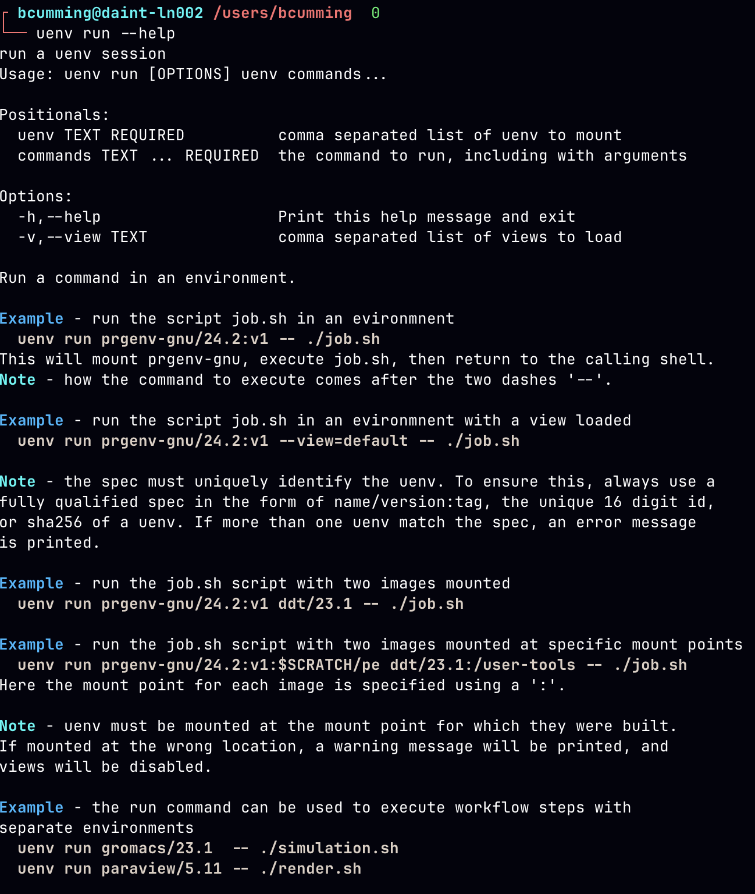

# New Features and Advanced Usage of uenv

<br>

Ben Cumming

bcumming.github.io/uenv-userlab-2026

CSCS User Lab Day 2026

---
layout: two-cols
layoutClass: gap-2
---

# uenv on Alps

Available on **Daint**, **Eiger**, **Santis** and **Clariden**.

The up-to-date `uenv` documentation is available on the **CSCS documentation** site:

* [uenv documentation](https://eth-cscs.github.io/cscs-docs/software/uenv/)
* [scientific application uenv](https://eth-cscs.github.io/cscs-docs/software/sciapps/)
* [programming environment uenv](https://eth-cscs.github.io/cscs-docs/software/prgenv/)

The uenv command line provides context-sensitve help using the `--help` flag:
```
uenv --help
uenv image --help
uenv image find --help
uenv run --help
```

::right::



---

# Cray modules on Alps

This Wednesday the `cray` module was removed from Eiger.

* on Eiger `intel-classic/26.07:v1` reproduces the old `PrgEnv-intel` module
    * `intel-classic` 2021 Fortran compiler
    * provided as an stop-gap for projects that require the old compiler
    * upgrade at the first opportunity

---

# New feature: `uenv inspect`

Before v10 of uenv we had run a uenv to inspect its views.

<br>

The new `uenv inspect` command shows information about a uenv without starting it

```bash
$ uenv inspect intel-classic/26.07:v1
repo default:/ritom/scratch/cscs/bcumming/.uenv-images
intel-classic/26.07:v1@eiger%zen2 mount at /user-environment
views:
  spack: configure spack upstream
  modules: activate modules
  intel (default):
```

---

# New feature: default  views

Some new uenv provide "default views" that are automatically loaded when run without a `--view`.

```shell
$ uenv inspect linaro-forge/26.0
repo team:/capstor/scratch/cscs/bcumming/ulabday26/repo
linaro-forge/26.0:v1@eiger%zen2 mount at /user-tools
views:
  spack: configure spack upstream
  forge (default):
```

When started, the view is automatically loaded:

```shell
$ uenv start linaro-forge/26.0
$ uenv status
uenv  linaro-forge
  image  linaro-forge/26.0:v1@eiger%zen2
  mount  /user-tools
  views  [forge]
```

**Note**: views named `default` are not the same as a "default view".

---
layout: two-cols
layoutClass: gap-2
---

# Tip: custom prompts

The `--format` flag to `uenv status` provides short descriptions of the currently loaded uenv:

```
$ uenv status --format=views
prgenv-gnu,editors[editors]
$ uenv status --format=short
prgenv-gnu,editors
```

These can be used to generate a custom prompts, similar to common extensions for Python and git.

::right::

**Example**: the following snippet in `.bashrc`:

```bash
_set_prompt() {
  local node_name
  node_name=$(hostname)
  node_name=${node_name#*-}

  local opt=""
  local ue
  ue=$(uenv --no-color status --format=views 2>/dev/null)
  [ -n "$uenv_str" ] && opt+=" uenv:${ue}"
  [ -n "$VIRTUAL_ENV" ] && \
    opt+=" py:$(basename "$VIRTUAL_ENV")"

  PS1="${USER}@${CLUSTER_NAME}::${node_name} ${opt} > "
}
PROMPT_COMMAND=_set_prompt
```

Gives the following prompt:

```
bcumming@eiger::ln001 uenv:prgenv-gnu,editors[editors] >
```

---
layout: two-cols
layoutClass: gap-2
---

# New: improved SLURM

The Slurm plugin will set up the uenv on compute nodes:

```bash
$ srun --uenv=prgenv-gnu/26.3 --view=default \
    -n8 -N4 -Ag33 ./a.out
```

The following is equivalent
```bash
$ uenv start prgenv-gnu/26.3 --view=default
$ srun -n8 -N4 -Ag33 ./a.out
```

**The plugin *forwards* the loaded uenv environment.**

::right::

```
#!/usr/bin
#SBATCH -uenv=prgenv-gnu/26.3
#SBATCH -view=default

# gcc from the uenv is available
gcc main.c

# launches with the uenv mounted
srun ./a.out

# launches with a different uenv
srun --uenv=namd/3.0 --view=namd namd3 +p 3 ...

# ??? what if I do not want to use a uenv here?
srun ./a.out

# error: a uenv is already loaded
uenv run namd/3.0 --view=mand namd3 += 3 ...
```

Avoid using `--uenv` flag on `sbatch`: the environment variables are set everywhere in the job, and can't be disabled.

---
layout: two-cols
layoutClass: gap-1
---

# Using uenv in sbatch

**Best Practice**: move environment description to leaves of workload tree.

```
#!/usr/bin
#SBATCH -n8
#SBATCH -N4
#SBATCH -Ag33

uenv run --view=default prgenv-gnu/26.3 gcc main.c

srun --view=default --uenv=prgenv-gnu/26.3 ./a.out

srun --uenv=namd/3.0 --view=namd namd3 +p 3 ...

# no uenv used
srun ./a.out
```

**Or**: set environment variables at the last possible moment.

::right::

**Change**: uenv now treats calling `sbatch` with a uenv loaded as a **hard error**.

Some workflows need more flexible control, e.g:
* when calling sbatch inside srun in sbatch (yes!)
* launcher scripts that call sbatch (e.g. CESM)

The `--uenv-passthrough` flag overrides the default behavior:
```
$ uenv start --view=esmf esmf/26.7
$ sbatch --uenv-passthrough=use ./job.sbatch
```

... or ignore any loaded uenv
```
$ sbatch --uenv-passthrough=ignore ./job.sbatch
```

**hint**: if you are using `--uenv-passthrough=ignore` on the login node... revisit your workflow

---
layout: two-cols
layoutClass: gap-1
---

# New: shared repos

```
$ uenv repo status
default:/ritom/scratch/cscs/bcumming/.uenv-images is readwrite
```

add the following to `~/.config/uenv/config.toml`

```toml
\[[repositories]]
name = 'team'
path = '/capstor/scratch/cscs/bcumming/ulabday26/repo'
```

then create the repo:

```
$ uenv repo create /capstor/scratch/cscs/bcumming/ulabday26/repo
$ uenv repo status
default:/ritom/scratch/cscs/bcumming/.uenv-images is readwrite
team:/capstor/scratch/cscs/bcumming/ulabday26/repo is readwrite
  - on a lustre file system
```

::right::

To use a specific repository:

```
$ uenv --repo=team image pull foo/26.7:v1
$ uenv --repo=team run foo/26.7:v1 -- foo-tool
$ srun --repo=team --uenv=prgenv-gnu foo-tool
```

* `uenv` searches through repositories until it finds a match
* `--repo=team,defalt` can be used to change search order.
* Slurm supports the `--repo` flag.

<br>

**This update aims to make it easier for teams to maintain a shared uenv repository.**

---

# Using uenv on different clusters

The `CLUSTER_NAME` variable defines the cluster on Alps.

`uenv` and the SLURM plugin use this variable to filter results.

```
$ echo $CLUSTER_NAME
santis
$ uenv image find pytorch --no-header
$ uenv image find pytorch@* --no-header
pytorch/v2.6.0:v1  gh200  clariden  fca6205ff6eec0e0   8,164    2025-04-04
pytorch/v2.6.0:v1  gh200  daint     fca6205ff6eec0e0   8,164    2025-04-04
$ uenv image pull pytorch/v2.6.0:v1@clariden
$ uenv start pytorch/v2.6.0@clariden --view=default
$ python -c "import torch; print(torch.cuda.is_available())"
True
# or
$ uenv --system=clariden start pytorch/v2.6.0 --view=default
```

**uenv are generally portable on the same node type**
* e.g. `clariden`, `santis`, and `daint` are almost identical at the OS level
* large divergence between cluster configurations might break some uenv in the future

---

## Thank you

<br>
<br>
<br>
<br>

## Please give feeback now or over lunch/coffee later


